# A decade of Air Pollution and Pm2.5 Risk
 
**Team Members:** Yelena Shabanova (320991), Alena Seliutina (323591), Alisa Lamina (321961), Luis Fernando Henriquez Patino (314661)
> **Mission:** Air pollution remains one of the most critical public health challenges in Europe. PM2.5 — fine particulate matter smaller than 2.5 micrometers — can penetrate deep into the lungs and enter the bloodstream, causing respiratory inflammation, reduced lung function, and increased mortality risk. This project analyses ten years of EEA air quality data to understand the **spatial and urban drivers of PM2.5** 
> and build a model capable of predicting pollution levels across locations.

---

## Contents

1. [Project Setup](#1-project-setup)
2. [Data Sources](#2-data-sources)
3. [Exploratory Data Analysis](#3-exploratory-data-analysis)
4. [Feature Engineering](#4-feature-engineering)
5. [Modeling](#5-modeling)
6. [Conclusion & Business Insights](#6-conclusion--business-insights)

---

## 1. Project Setup

### Environment


```bash
pip install pandas numpy matplotlib seaborn plotly kaleido
pip install geopandas
pip install scikit-learn xgboost shap
pip install requests
```


We used the following libraries throughout the project:

- **pandas** → data loading, cleaning, merging datasets, and feature creation  
- **numpy** → numerical operations and array manipulation  

- **matplotlib / seaborn** → static visualizations for EDA (distributions, trends, missing values)  
- **plotly.express / plotly.graph_objects** → interactive visualizations (maps, comparisons, model analysis)  
- **plotly.subplots** → combining multiple plots into one figure  
- **kaleido** → exporting Plotly figures as PNG images for the README  

- **scikit-learn**:
  - **ColumnTransformer / Pipeline** → structured preprocessing and modeling workflow  
  - **OneHotEncoder / StandardScaler** → encoding categorical variables and scaling features  
  - **SimpleImputer** → handling missing values  
  - **RandomForestRegressor** → non-linear model for prediction  
  - **Ridge** → linear baseline model  
  - **GroupShuffleSplit** → time/spatial-aware data splitting  
  - **metrics (MAE, RMSE, R²)** → model evaluation  
  - **clone** → reproducible model retraining  

- **xgboost (XGBRegressor)** → gradient boosting model for improved predictive performance  

- **warnings** → suppressing unnecessary warnings for cleaner output  
- **os** → file handling and dataset management  
### Repository Structure

```
├── 2015-2024/                  # Raw EEA CSVs — one file per year
│   └── DataExtract{year}.csv
├── country_comparison/         # Neighbouring countries data (FR, CH, AT)
├── data_boundaries/            # ISTAT comuni shapefile (2024)
│   └── comuni_2024/
├── LandCover2018/              # CORINE Land Cover GDB + computed green_ratio.csv
├── openaq/                     # Cached OpenAQ API outputs (coverage, sensors, monthly)
├── weather/                    # Cached Open-Meteo monthly weather
├── model_output/               # CSVs exported by model.ipynb
├── images/                     # All charts and maps referenced in this README
├── eda.ipynb                   # Exploratory Data Analysis
├── features.ipynb              # Feature Engineering Pipeline → df_model_monthly.csv
├── model.ipynb                 # Three models + comparison
├── df_model.csv                # Annual feature matrix (output of features.ipynb)
└── df_model_monthly.csv        # Monthly feature matrix with lags and weather
```
---

## 2. Data Sources 
Complete table of all used datasets:

| Dataset | External Source                                                                                                                                                                        | Internal Data | Purpose |
|---|----------------------------------------------------------------------------------------------------------------------------------------------------------------------------------------|---|---|
| EEA Air Quality Data (2015–2024) | [EEA](https://discomap.eea.europa.eu/App/AQViewer/index.html?fqn=Airquality_Dissem.b2g.AirQualityStatistics)                                                                           | [2015–2024 Raw](2015-2024/) | Core pollution measurements across European stations |
| OpenAQ PM2.5 Data | [OpenAQ API](https://openaq.org/)                                                                                                                                                      | [Raw](openaq/openaq_monthly_raw.csv) | Monthly PM2.5 observations for temporal modeling |
| OpenAQ Coverage & Sensors | [OpenAQ API](https://openaq.org/)                                                                                                                                                      | [Coverage](openaq/openaq_coverage.csv) • [Sensors](openaq/openaq_sensors.csv) | Data reliability and station metadata |
| Weather Data (Temperature, Wind, Precipitation) | [Open-Meteo](https://open-meteo.com/)                                                                                                                                                  | [Processed](weather/weather_monthly.csv) | Environmental drivers of pollution |
| Land Cover / Green Area | [EEA CORINE](https://land.copernicus.eu/en/products/corine-land-cover/clc2018)                                                                                                         | [Green Ratio](LandCover2018/green_ratio.csv) | Green space ratio per location |
| Administrative Boundaries (ISTAT Comuni 2024) | [ISTAT](https://www.istat.it/notizia/confini-delle-unita-amministrative-a-fini-statistici-al-1-gennaio-2018-2/)                                                                        | [Shapefiles](data_boundaries/comuni_2024/) | Spatial joins and city-level aggregation |
| Population Data | [UN Data](https://data.un.org/) • [ISTAT](https://esploradati.istat.it/databrowser/#/en/dw/categories/IT1,POP,1.0/POP_POPULATION/DCIS_POPORESBIL1/IT1,22_315_DF_DCIS_POPORESBIL1_1,1.0) | [Final Dataset](joined_commune.csv) | Population density and urban activity features |
| Country Comparison Subsets | [EEA](https://discomap.eea.europa.eu/App/AQViewer/index.html?fqn=Airquality_Dissem.b2g.AirQualityStatistics) | [AT / CH / FR](country_comparison/) | Cross-country pollution analysis |


### EEA Annual Air Quality Statistics

The core dataset consists of **10 separate CSV files** (one per year, 2015–2024) published by the European Environment Agency. 
After merging, the combined dataset contains approximately **468,000 observations** from monitoring stations across Europe, with a focus on Italy.


### Country Comparison Dataset

To contextualise Italian pollution levels, additional data was loaded for **France (FR), Switzerland (CH), and Austria (AT)** from the `country_comparison/` folder. This allows direct cross-border comparisons of pollutant medians.

### Population Data (UN + ISTAT)

The EEA `City Population` field was nearly static across years, making demographic trend analysis impossible. Therefor, we merged two external sources:

- **Primary:** UN World Urbanization Prospects (city-level, yearly) — years with missing values were filled conservatively with the minimum of the adjacent available years.
- **Fallback:** ISTAT municipal population (December 2024) — applied to cities not matched in the UN dataset.

### CORINE Land Cover 2018

The CORINE Land Cover 2018 vector dataset (100 m resolution, Italy) was used to compute a `green_ratio` for each monitoring station's municipality — the share of agricultural and forest area over total comune area (see [Feature Engineering](#4-feature-engineering)).

### OpenAQ (Monthly Data, 2020–2024)

EEA data provides annual aggregates only. To capture **seasonal dynamics** (e.g. winter temperature inversions in the Po Valley), monthly PM2.5 measurements were pulled from the OpenAQ v3 API for matched Italian stations. Coverage was restricted to 2020–2024 where PM2.5 sensor availability was sufficient (145 sensors vs. only 20 before 2020).

---

## 3. Exploratory Data Analysis


Pollution is not distributed equally across regions. Its levels are influenced by geography, urban infrastructure, and human activity. The EDA is structured to progressively reveal these drivers and motivate every feature included in the final model.
> **`eda.ipynb`** — full EDA including data quality checks, univariate distributions, temporal trends, geographic patterns, and identification of key features for modelling.


### [3.1 Data Quality Assessment](eda.ipynb#data-quality-assessment)

Before drawing any conclusions, we need to understand how complete and trustworthy the data is.
Data quality problems — missing values, incomplete year coverage, unvalidated entries — can produce misleading charts and wrong conclusions if ignored.
This section answers: can we trust this data, and where are the gaps?


**Missing values:**
- `City` was missing for ~62% of records. For Italy, missing cities were recovered by spatially joining station coordinates (lat/lon) with ISTAT `comuni` boundaries using GeoPandas — assigning each station to its municipality.
- Negative pollution measurements (physically impossible) were flagged as reporting errors and removed.

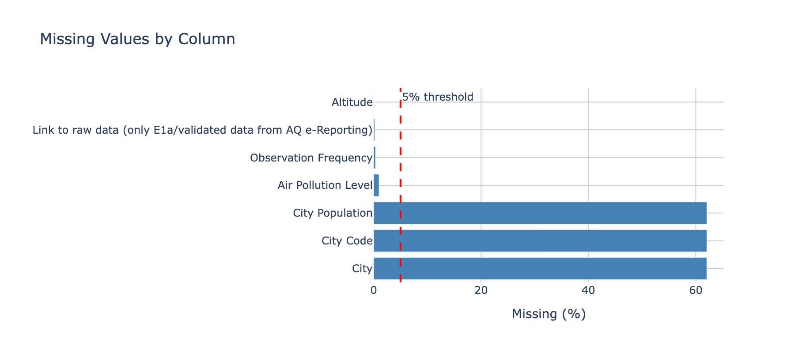

**Data coverage:** The EEA recommends ≥ 75% annual coverage for a statistic to be considered valid. The distribution of coverage values was examined to understand how many records fall below this threshold.

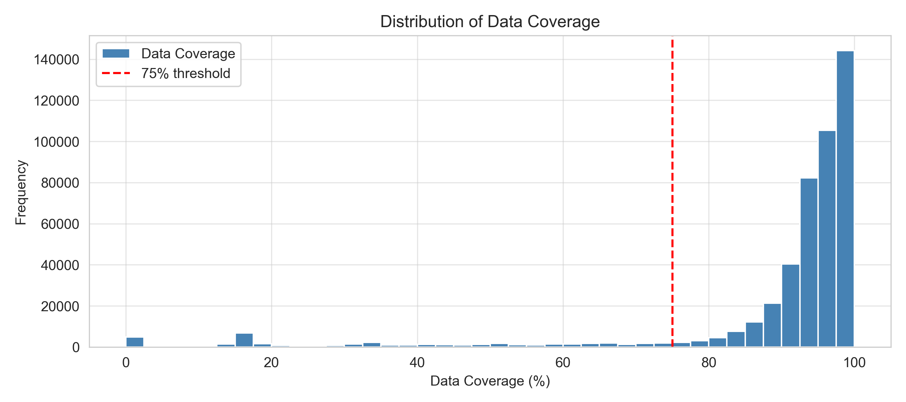

**Aggregation types:** Each row represents a statistical summary, not a raw reading. Multiple aggregation types exist per station per year. 

#### Aggregation Process Breakdown

Each row does not represent a direct sensor reading. It represents a statistical summary of an entire year.
Different rows for the same station and year represent different statistics:
annual median, annual maximum, annual 99th percentile, and so on.

For further analysis, we consistently used the annual median (P1Y-day-per50),
which is the 50th percentile of daily values over a full year.

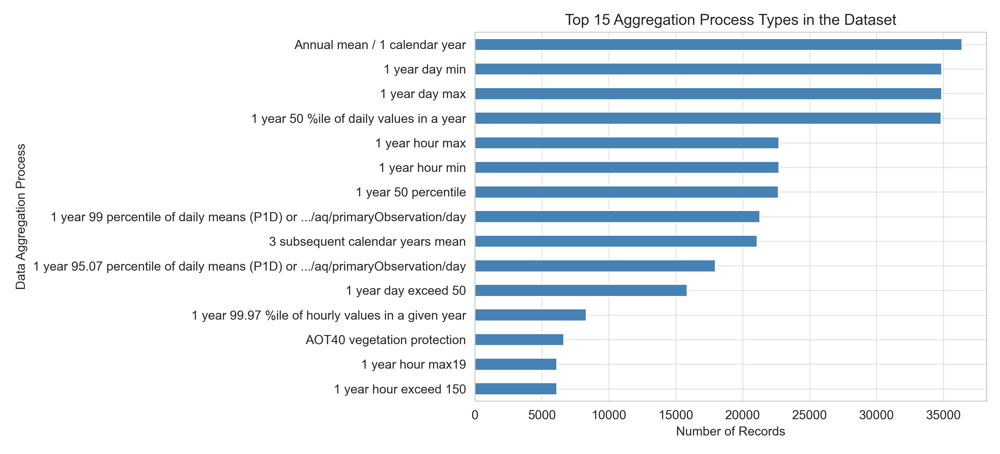

---

### [3.2 Pollutant Distributions](eda.ipynb#eda-pollutant-distributions)

Before comparing across time or geography, we need to understand what each pollutant looks like on its own.
Univariate analysis answers:

- Which pollutants are most commonly measured in the dataset?
- What is the typical range of pollution levels across European stations?
- Are there extreme outliers? Is the distribution skewed?

From here onward we work with annual median values only (aggregation code P1Y-day-per50).
This gives us one representative number per station per year, making comparisons fair and consistent.

We are still on raw data — no quality filters applied. What you see includes all coverage levels and verification statuses.

Firstly, we look on present pollutants:

**Focus pollutants:** NO₂, PM10, PM2.5, O₃  
**Secondary pollutants:** SO₂, CO, C₆H₆
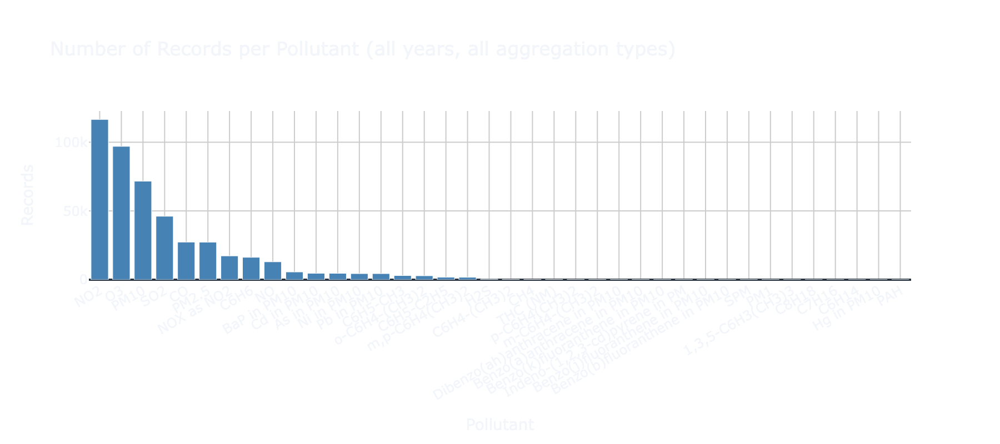


All four focus pollutants show **right-skewed distributions** — most stations record moderate levels, but a small number of stations are severe hotspots far above average. This skew is visible in both the histograms and the boxplot.

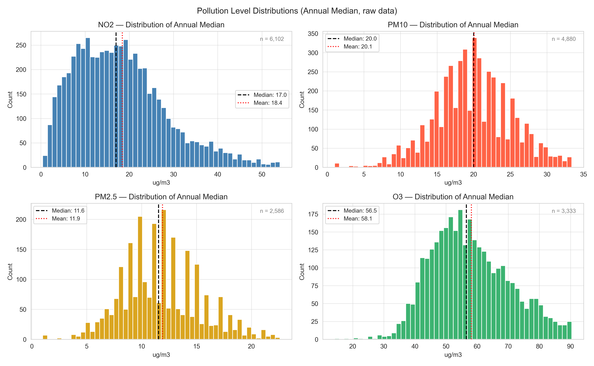
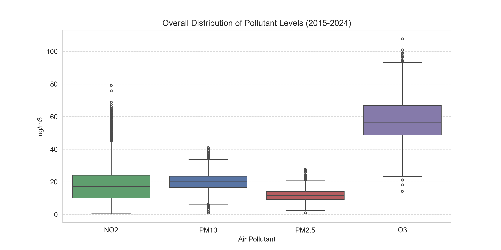

Secondary pollutants (SO₂, CO, C₆H₆) also show skewed distributions and are included to enrich the interpretation of emission sources.

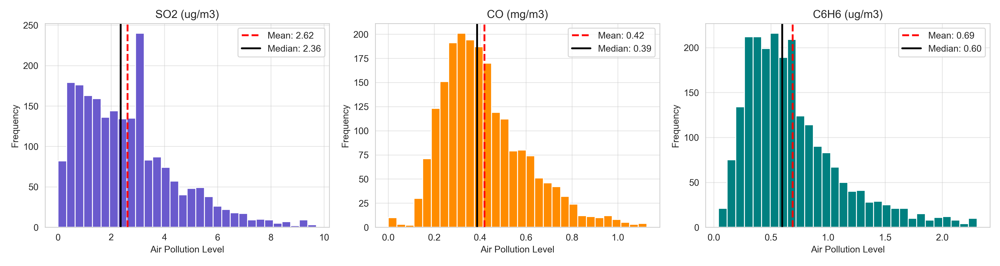

**Business insight:** The gap between median and mean reveals how much extreme stations inflate the average. 
Outliers typically represent high-traffic urban cores or industrial areas — the most important for stations regulators. 

---

### [3.3 Temporal Trends (2015–2024)](eda.ipynb#eda-trends-over-2015-2024)

Three events make this decade analytically interesting: **COVID-19 lockdowns (2020)**, ongoing **EU Clean Air directives**, and the **post-COVID rebound (2021–2022)**.

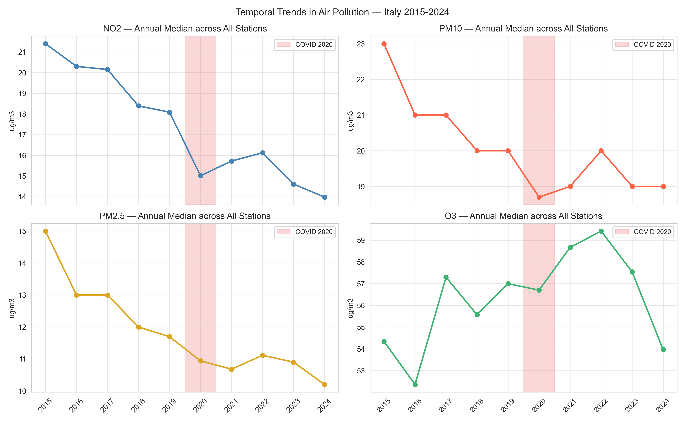
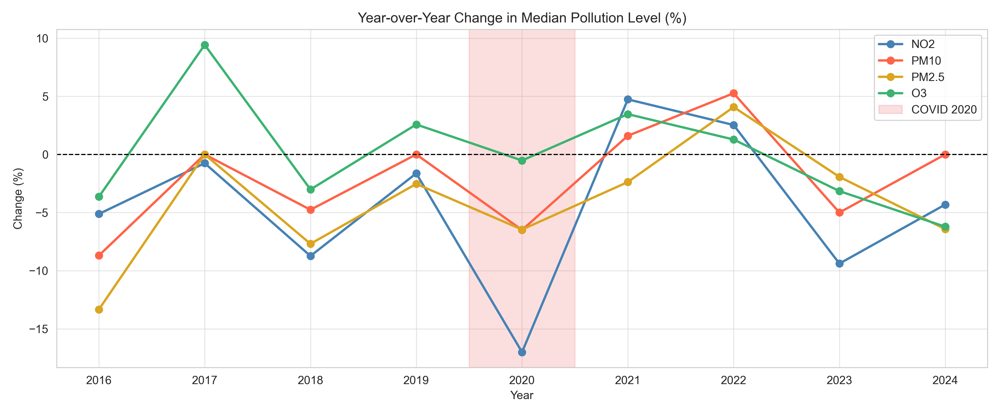

**Key findings:**
- A visible drop in 2020 for traffic-related pollutants (NO₂, PM) confirms that human activity directly drives pollution.
- A consistent downward trend from 2015 onward supports the effectiveness of EU Clean Air policies.
- Secondary pollutants (SO₂, CO, C₆H₆) show relatively stable or gradually declining trends, 
suggesting that industrial combustion and fuel-related emissions have improved steadily over the last decade, though at a slower pace than traffic-related pollutants
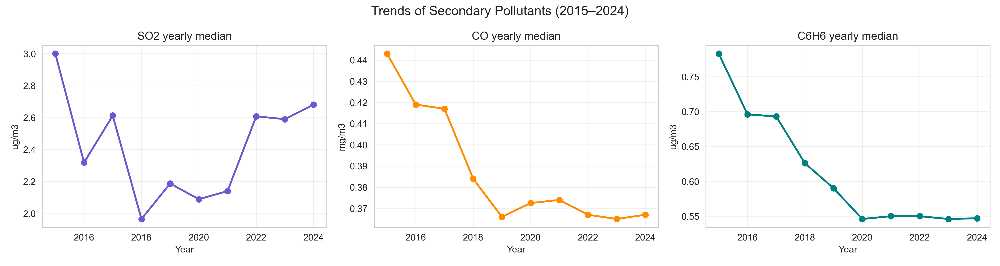

>  **Important note:** Since there is no 2014 data, it's impossible to calculate 2015 change.
> 
> **Connection to [Feature Engineering](#4-feature-engineering):** The COVID drop and year-over-year variation confirm that `Year` and `Season` carry real temporal signal. 
> Monthly lag features (PM2.5_lag1/2/3) are motivated by the persistence of pollution trends observed here.

---

###  [3.4 Geographic Patterns](eda.ipynb#eda-geographic-patterns)

**Country comparison:** Pollution is not evenly distributed across Europe. Certain countries consistently show higher median levels for each pollutant.

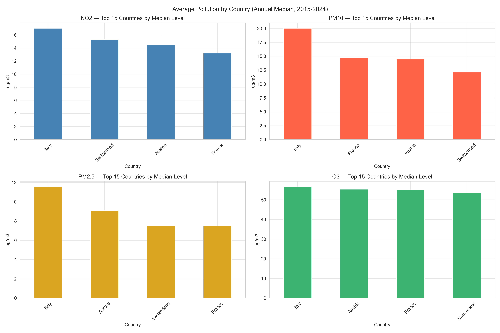

**Most polluted Italian cities:** When ranking cities by pollutant levels across all years, a small number of locations repeatedly appear as hotspots. Notably, cities in **Northern Italy** (blue bars, latitude > 43°) dominate the rankings for PM10 and PM2.5, while Southern cities appear more in O₃ rankings.


**Station context:** Traffic stations record the highest NO₂ levels. 
Urban areas are systematically more polluted than suburban or rural areas. This directly validates the monitoring approach and motivates the use of `Station_Type` and `Station_Area` as features.

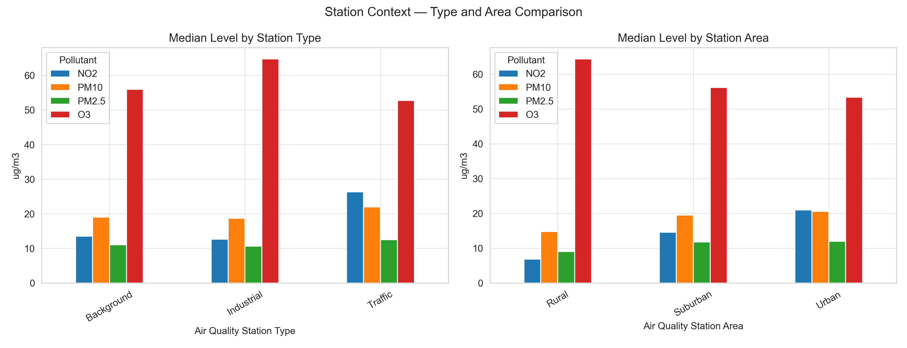

**North–South gradient in Italy:** Using a composite pollution index (concentration / EU limit), Northern Italy shows higher average and median pollution levels than Southern Italy. 
This pattern indicated the combination of industrial activity, higher urban density, and geographical conditions that restrict pollutant dispersion — most notably the **Po Valley basin**.

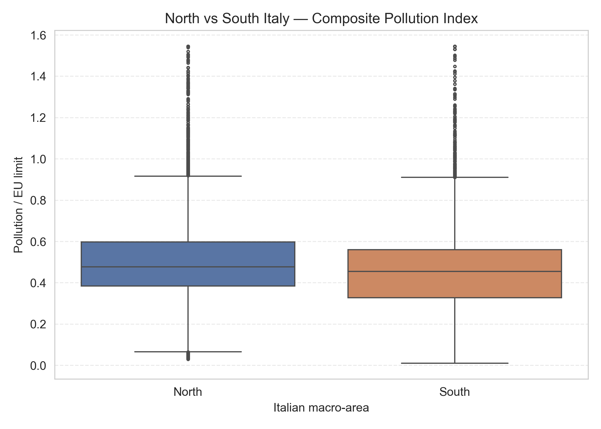

> **Connection to [Feature Engineering](#4-feature-engineering):** Geographic location matters. `Latitude`, `Longitude`, and the North-South gradient directly motivate including spatial coordinates as features.

---

### [3.5 Features of Interest](eda.ipynb#features-of-interest)

#### Altitude

Stations at higher altitudes benefit from stronger atmospheric mixing and wind dispersion. The correlation between PM2.5 and station altitude is **−0.315** — a moderate negative relationship. The quartile boxplot confirms this: lower-altitude stations (Q1) have higher PM2.5 concentrations.

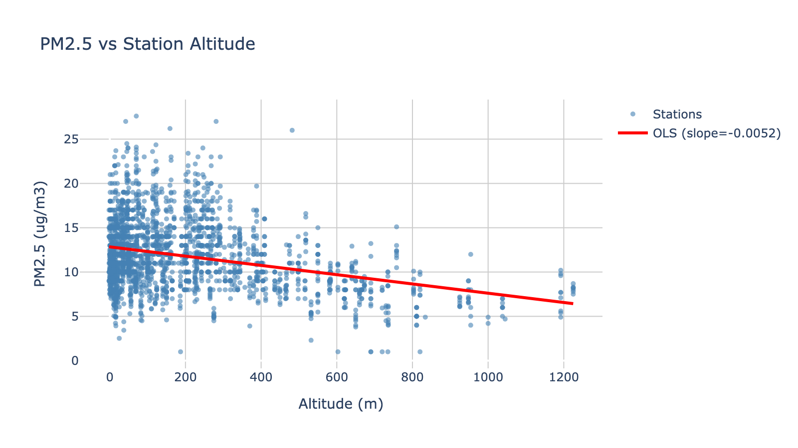
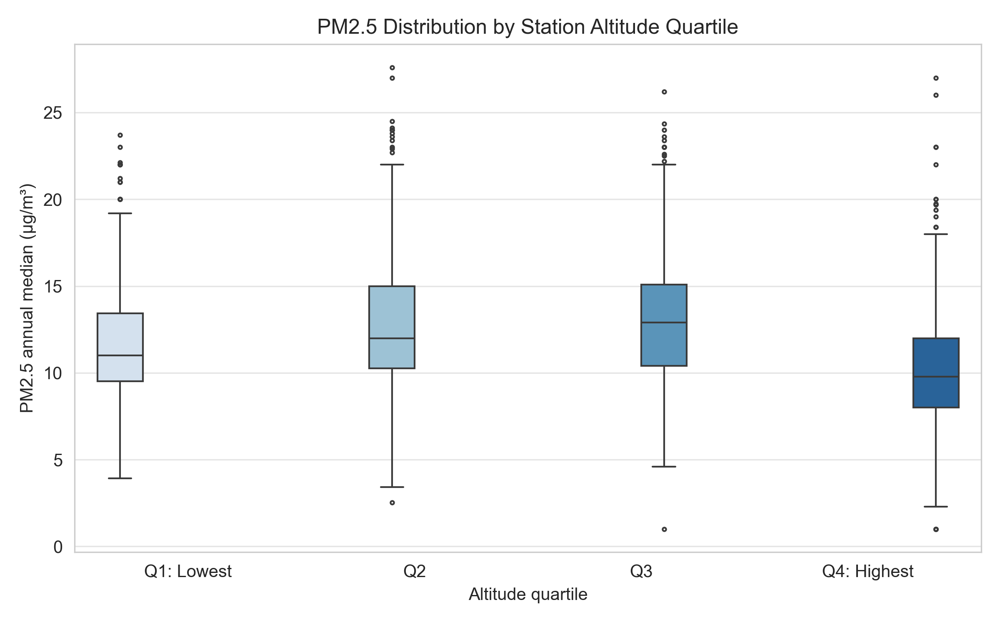

> **Connection to [Feature Engineering](#4-feature-engineering):** `Altitude` is included as a feature. Low-altitude areas (valleys, basins like the Po Valley) trap pollutants through temperature inversions and limited air circulation.

#### Green Space Ratio

The green space ratio (computed from CORINE Land Cover 2018) represents the share of agricultural and forest land in a monitoring station's municipality. The correlation between green ratio and PM2.5 is **negative** — greener comuni tend to have lower PM2.5 concentrations.


> **Connection to [Feature Engineering](#4-feature-engineering):** `Green_Ratio` is included as a continuous 0–1 feature. It carries more predictive signal than raw CLC class categories (76% of stations sit on artificial surfaces).

#### Population Density

The year-over-year drop in 2020 (COVID) directly shows that changes in human concentration and urban activity influence PM2.5. 
Cities with higher population density consistently show increased pollution. Population density was computed from UN (primary) and ISTAT (fallback) data combined with ISTAT comuni area (km²).

Findings were provided in the section 
[Density vs pollution (city-level, median 2015–2024)](eda.ipynb#density-vs-pollution-city-level-median-20152024) of `eda.ipynb`.

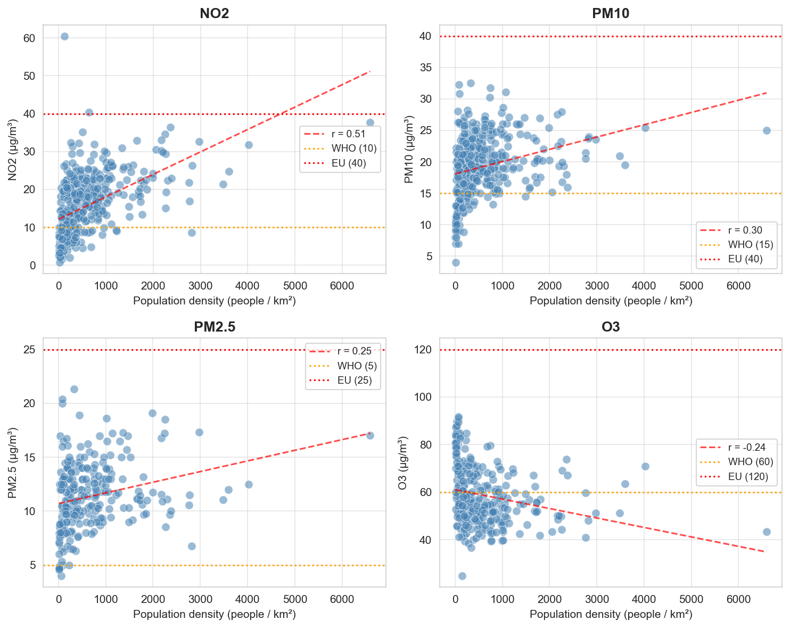

This graph confirmed a positive relationship between population density and PM2.5 concentrations. Cities with higher population density tend to experience increased air pollution
> **Connection to [Feature Engineering](#4-feature-engineering):** `Population_Density` is included as a proxy for human activity intensity.

---

### [3.6 Correlation Structure](eda.ipynb#correlation-and-feature-relationships)

Pollutant co-occurrence patterns reveal shared emission sources. NO₂, PM10, and PM2.5 tend to co-occur at the same stations (combustion engines, industry), while O₃ shows negative correlation with combustion pollutants due to its secondary atmospheric formation.

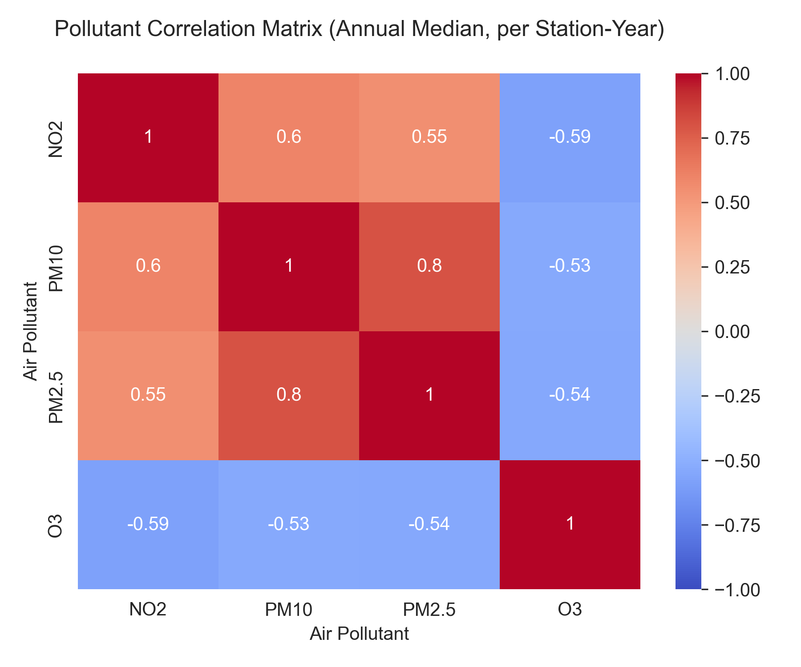
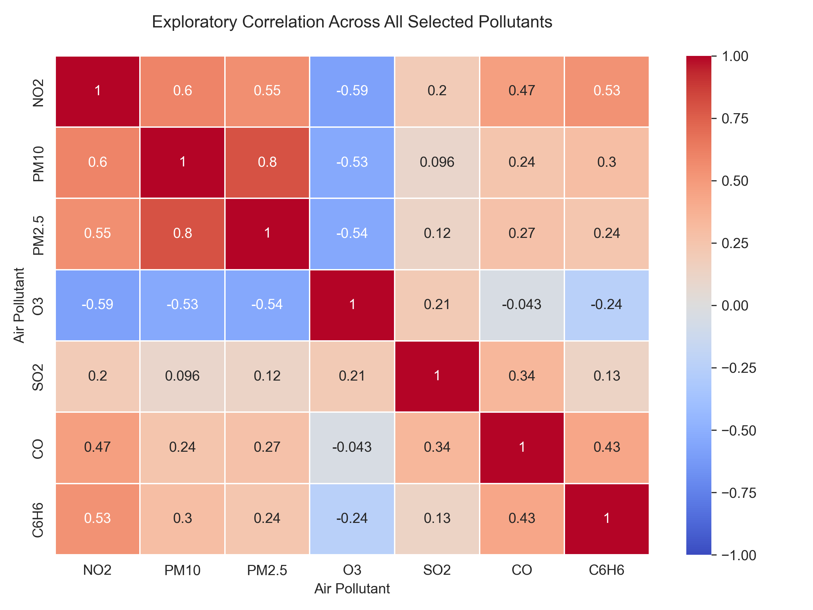
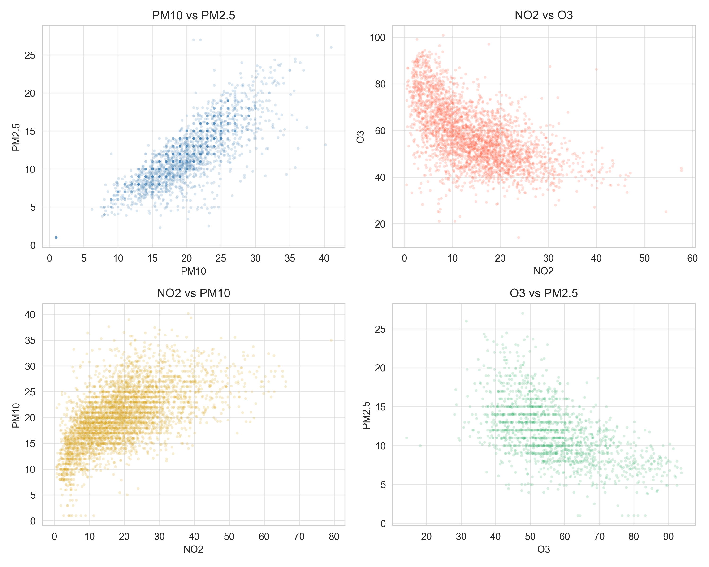

**Business insight:** If NO₂ and PM are strongly correlated, targeting one source (e.g. reducing car traffic) tends to improve multiple pollutants simultaneously.

### Dynamic city-level maps

To better understand spatial and temporal pollution dynamics, we aggregate station-level measurements to the city–year level. For each city and year, pollutant concentrations are computed as the median across available monitoring stations.
This aggregated dataset is then enriched with external population data (UN + EEA fallback), allowing us to visualise how pollution patterns evolve across Italian cities over time.

#### Map 1: Limit‑weighted pollution index (city/year, 2015–2024)

Colour = mean over pollutants of (concentration / EU limit). Values > 1 mean the city–year exceeds at least one limit on average. 
Circle size = population. Interactive: use the slider to change year.

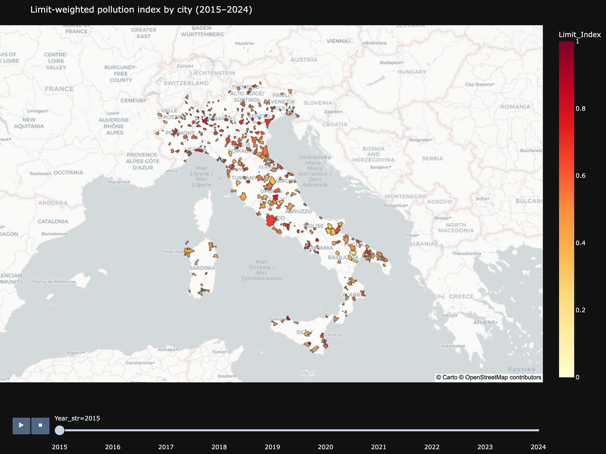
### Map 2: EEA Air Quality Index (city level)

Colour = EEA 2024 AQI band (1–6: Good → Extremely poor). Use the year slider to compare years.
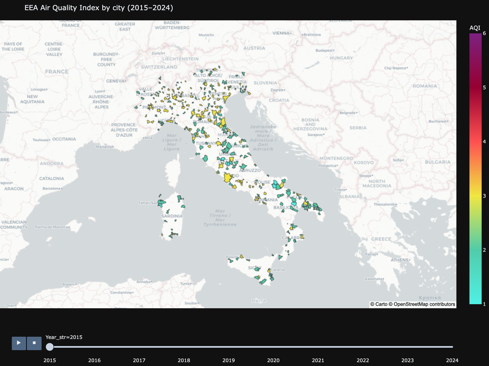
### Map 3: WHO vs EU limit exceedance (comune level)

- **Below WHO** — meets WHO guidelines.
- **Exceeds WHO only** — above WHO but within EU limits.
- **Exceeds EU limit** — above EU limit.

Use the year slider to explore 2015–2024.
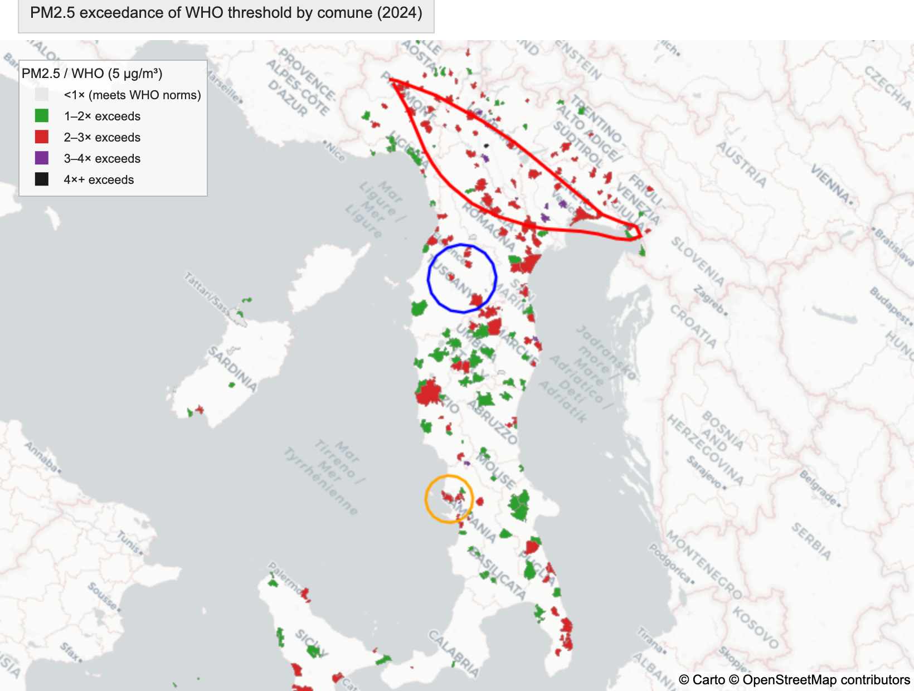

---

## 4. Feature Engineering

> **`features.ipynb`** — takes features `eda.ipynb` and builds the complete feature matrix for model training. Runs end-to-end with no intermediate files required.  
> **Output:** `df_model.csv` (annual) and `df_model_monthly.csv` (monthly with lags and weather).

### [4.1 Annual Feature Matrix](features.ipynb#feature-correlation-heatmap):

Feature Correlation Heatmap
The annual matrix (`df_model.csv`) aggregates EEA station-year records into one row per `(station × year)` for Italian PM2.5 stations. 
Features are collected from EDA findings:

| Feature | Source | EDA Motivation |
|---|---|---|
| `PM2_5` | EEA annual median | **Target variable** |
| `NO2`, `PM10`, `O3` | EEA annual median | Co-pollutant correlations |
| `Altitude` | Station metadata | Negative correlation with PM2.5 (−0.315) |
| `Latitude`, `Longitude` | Station metadata | North–South gradient; spatial hotspots |
| `Station_Type`, `Station_Area` | Station metadata | Urban > suburban > rural pollution pattern |
| `Green_Ratio` | CORINE Land Cover 2018 | Greener areas → lower PM2.5 |
| `Population_Density` | UN/ISTAT + comuni area | Human activity proxy; COVID drop evidence |

[Green Space Ratio computation](features.ipynb#corine-land-cover-2018--green-space-ratio):
 For each station, the CORINE Land Cover GDB was spatially joined to ISTAT comuni. Green ratio = (agricultural area + forest area) / total comune area.

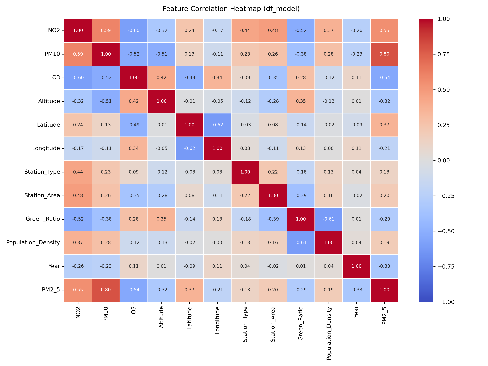

### [4.2 Monthly Enrichment via OpenAQ](features.ipynb#monthly-enrichment-via-openaq)

While the exploratory analysis and initial feature construction were based on annual data, this level of aggregation is not sufficient for predictive modeling.
Annual averages smooth out short-term variations and fail to capture seasonal pollution dynamics. However, PM2.5 levels are strongly influenced by **monthly patterns**, like winter temperature inversions in the Po Valley, spring agricultural burning, or summer ozone formation.
For this reason, we transition from an annual feature matrix to a **monthly modeling framework**, enriching the dataset with higher-frequency data from OpenAQ and weather sources. 
This allows the model to capture short-term spikes and improves predictive performance.

Three-step process:
1. **Station coverage check** — match each EEA station to the nearest OpenAQ location within 1 km (cached in `openaq/openaq_coverage.csv`).
2. **Sensor discovery** — retrieve sensor IDs for PM2.5, PM10, NO₂, and O₃ per matched location (cached in `openaq/openaq_sensors.csv`).
3. **Monthly data pull** — fetch monthly aggregated measurements for 2020–2024 via `/v3/sensors/{id}/days/monthly` (cached in `openaq/openaq_monthly_raw.csv`).

Coverage was restricted to 2020+ because only 20 PM2.5 sensors were available before 2020, against 145 from 2020 onward. Using pre-2020 annual EEA values as fill would flatten seasonal variation and introduce **data leakage** (annual EEA median computed from the full calendar year, including future test months).

###  [4.3 Weather Features (Open-Meteo)](features.ipynb#weather-features-open-meteo):


Physical drivers of PM2.5 that season alone cannot capture:

- **Temperature** — winter inversions trap pollution close to the ground
- **Wind speed** — low wind = less dispersion = higher PM2.5
- **Precipitation** — rain washes out particulate matter

Monthly averages were fetched from Open-Meteo's archive API (free, no key required). Stations within 55 km share the same 0.5° grid cell, reducing 144 API calls to ~62 without meaningful loss of resolution.


### [4.4 Lag Features](features.ipynb#lag-features):


PM2.5 is a **temporally persistent process**, meaning that current pollution levels are strongly influenced by previous periods due to accumulation effects in the atmosphere.

To capture this behavior, we introduced **lag-based features**, including:
- past PM2.5 values (previous 1–3 months): `PM2_5_lag1, PM2_5_lag2, PM2_5_lag3`   
- short-term rolling statistics (3-month average and variability) : `PM2_5_roll3_mean, PM2_5_roll3_std`
- lagged values of co-pollutants (PM10, NO₂, O₃): `PM10_lag1, NO2_lag1, O3_lag1`
- lagged weather conditions (temperature, wind speed, precipitation): `Temp_Mean_lag1, Wind_Speed_lag1, Precipitation_lag1` 

These features allow the model to incorporate **temporal dependencies** and better predict short-term pollution dynamics.

Seasonal encoding uses **sin/cos** of month index so December is numerically adjacent to January, which helps linear models and Ridge learn smooth seasonality.

### [4.5 Final Monthly Correlation Matrix](features.ipynb#feature-correlation-heatmap-monthly)

To validate the relationships between the engineered features, we analyzed the correlation structure of the final monthly dataset (`df_model_monthly.csv`):

| Column group | Features |
|---|---|
| Identifiers | `eoi_code`, `date`, `Year`, `Month`, `Season` |
| Target | `PM2_5` |
| Co-pollutants | `PM10`, `NO2`, `O3` |
| PM2.5 history | `PM2_5_lag1/2/3`, `PM2_5_roll3_mean`, `PM2_5_roll3_std` |
| Co-pollutant lags | `PM10_lag1`, `NO2_lag1`, `O3_lag1` |
| Weather (current) | `Temp_Mean`, `Wind_Speed`, `Precipitation` |
| Weather (lagged) | `Temp_Mean_lag1`, `Wind_Speed_lag1`, `Precipitation_lag1` |
| Spatial | `Altitude`, `Latitude`, `Longitude` |
| Station context | `Station_Type`, `Station_Area` |
| Urban/environmental | `Green_Ratio`, `Population_Density` |
| Cyclical time | `month_sin`, `month_cos` |


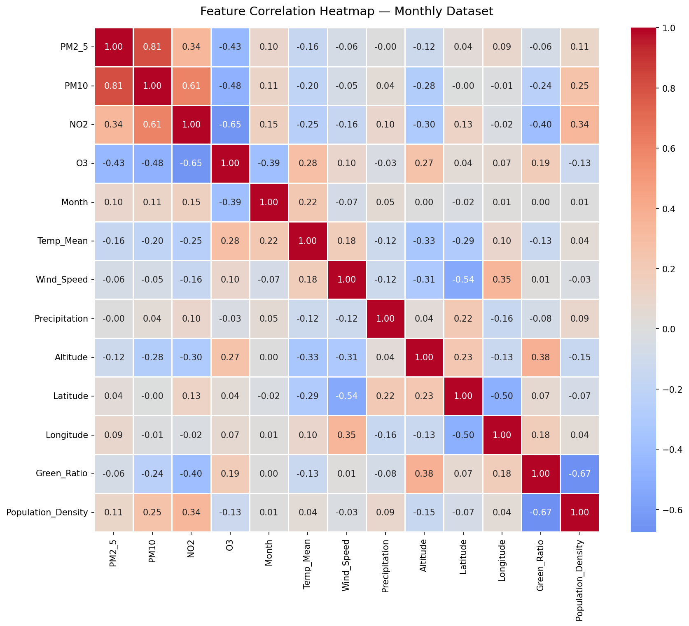
Overall, the correlation structure confirms that the selected features capture both environmental and human-driven factors, providing a strong foundation for predictive modeling.
---

## 5. Modeling

> **`model.ipynb`** — three models evaluated under two split strategies. Primary outputs saved to `model_output/`.

### Architecture Overview

| Model | Algorithm | Feature Set | Goal |
|---|---|---|---|
| **A** | Random Forest + XGBoost | Environmental, spatial, contextual (no lags) | Policy simulation: what can municipalities act on? |
| **B** | Random Forest | All features + PM2.5 lags, rolling stats, lagged pollutants, weather | Accuracy benchmark |
| **C** | Ridge Regression | Same as Model A | Linear baseline with signed coefficients |

**Two evaluation splits:**
- **Time split:** train on earlier months (80%), test on later months (20%) — simulates real forecasting.
- **Spatial split:** train on some stations, test on completely unseen stations (`GroupShuffleSplit`, 20% test) — simulates deployment to new locations.

---

### [Model A — Environmental & Spatial (RF + XGBoost)](model.ipynb#model-a-random-forest--xgboost)


Model A uses only non-pollutant features: `seasonality, weather, geographic coordinates, green ratio, population density, and station metadata`. This allows interpreting structural environmental drivers of PM2.5 without relying on pollutant inputs that may not be available at prediction time.

Two algorithms are trained on both splits; the **champion is selected by lowest average RMSE across both splits**. 
The winner is then retrained on the full dataset for SHAP analysis.

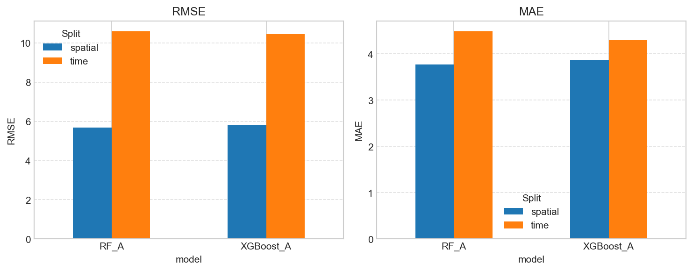

**Residuals (spatial split):**

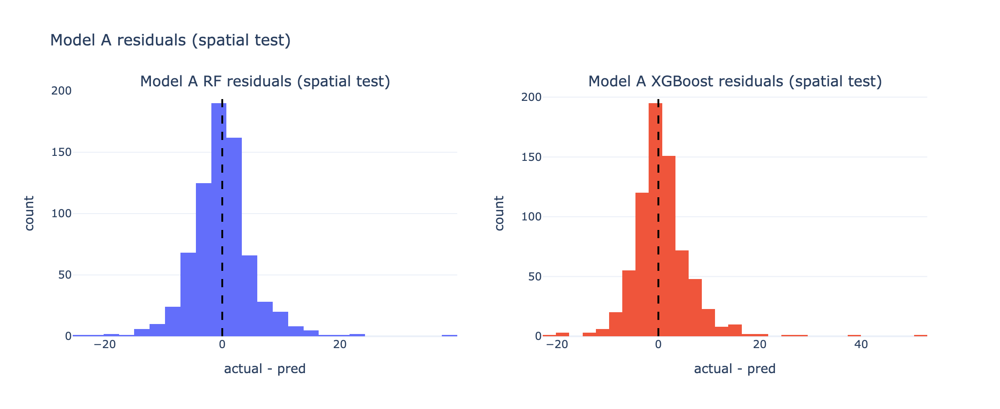

**SHAP Analysis — what drives PM2.5 in Model A?**

SHAP assigns a contribution value to every feature for each prediction. Pink = higher-than-average feature value; blue = lower-than-average.

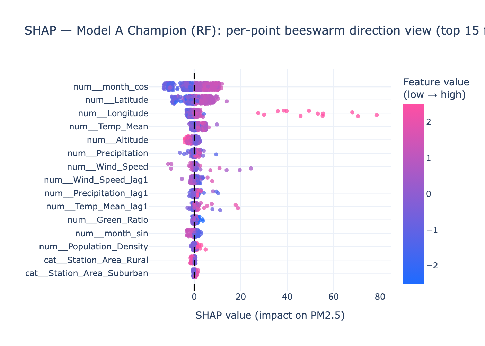
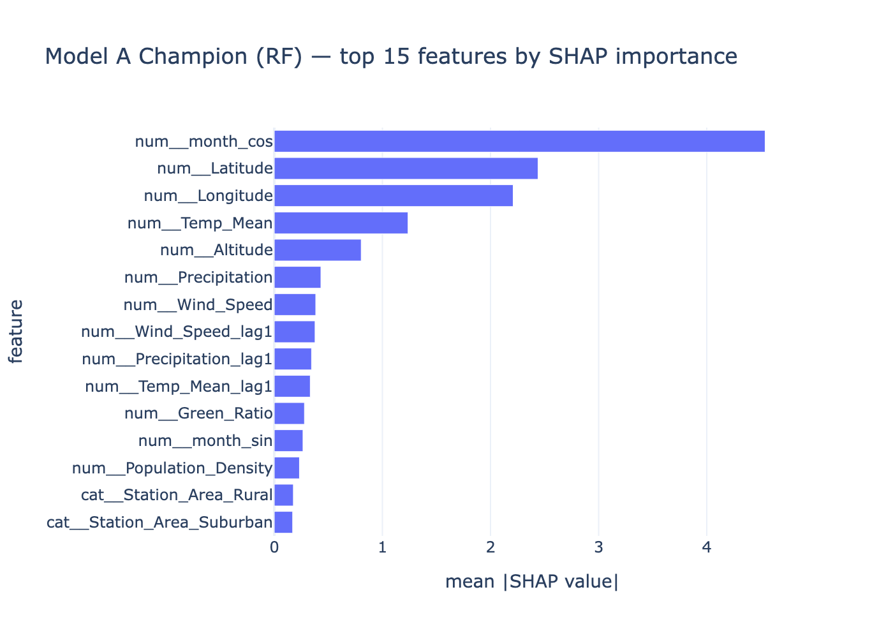

Top drivers identified: `Month` (seasonality), `Latitude`, `Longitude`, `Altitude`, `Temp_Mean`, `Wind_Speed` — confirming the EDA findings that geography and climate are the primary structural determinants of PM2.5.

---

###  [Model B — Full Predictive RF (With Lags)](model.ipynb#model-b--random-forest-environmental--pm25-history--lagged-pollutants)

Model B adds PM2.5 lags, rolling statistics, and lagged co-pollutants on top of all Model A features. Comparing A vs B directly measures **how much pollution memory and co-pollutant history improve forecasting**.

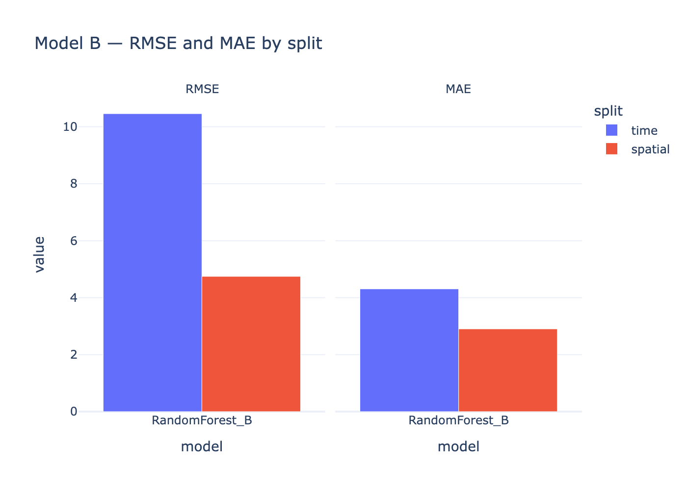

**Residuals:**

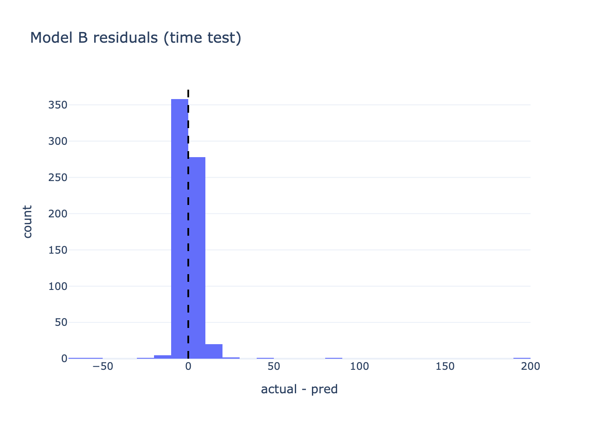
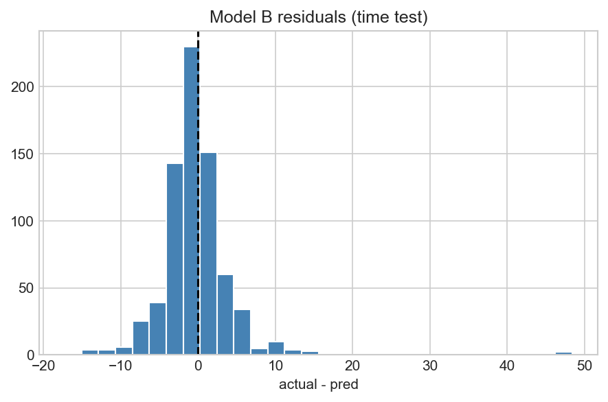

**SHAP Analysis — Model B:**

With lags available, `PM2_5_lag1` and `PM2_5_roll3_mean` dominate the SHAP rankings — confirming that PM2.5 is strongly temporally persistent.

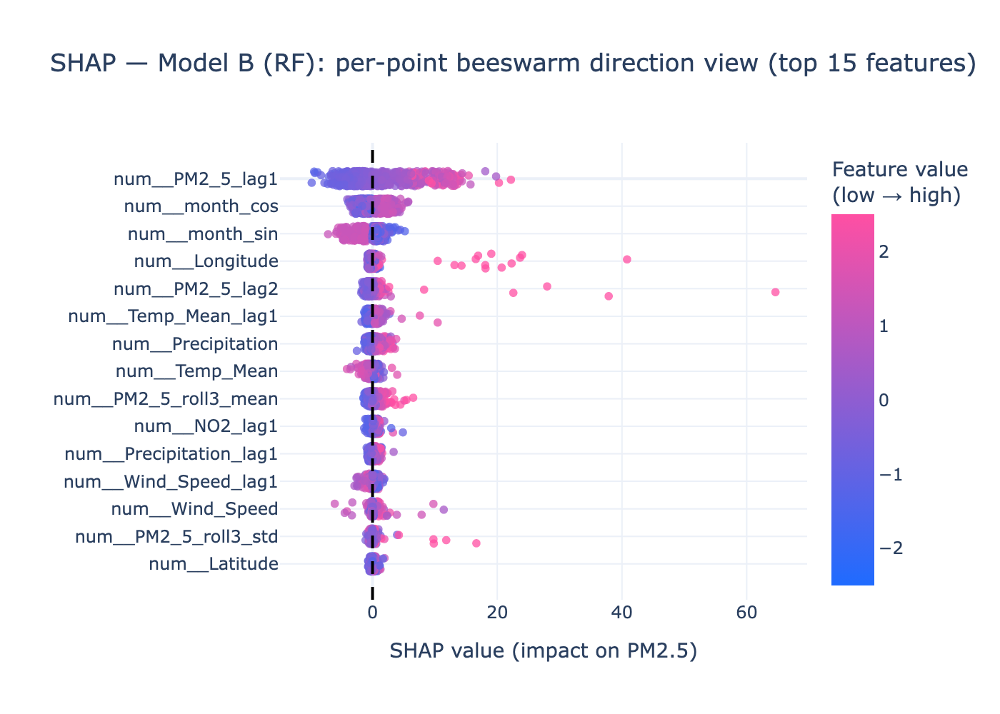
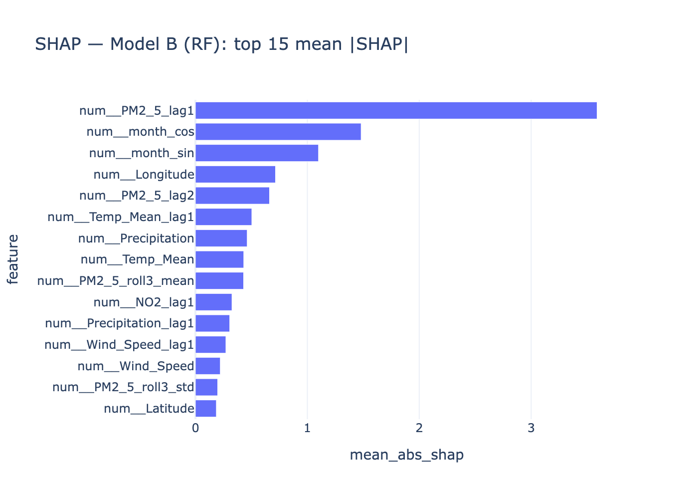

---

### [Model C — Ridge Regression (Linear Baseline)](model.ipynb#model-c--ridge-regression-linear-baseline)
Ridge uses the same feature set as Model A. It provides interpretable signed coefficients and a linear performance baseline for comparison.

**Performance (Ridge):**
- Time split: MAE ≈ 5.21, RMSE ≈ 10.00, R² ≈ 0.35
- Spatial split: MAE ≈ 4.92, RMSE ≈ 6.84, R² ≈ 0.32

**Coefficient analysis:** Positive coefficients increase predicted PM2.5; negative coefficients decrease it. City indicators have the strongest impact, suggesting location dominates. Temperature carries a negative coefficient — higher temperatures are associated with lower PM2.5 (consistent with SHAP findings in Model A).

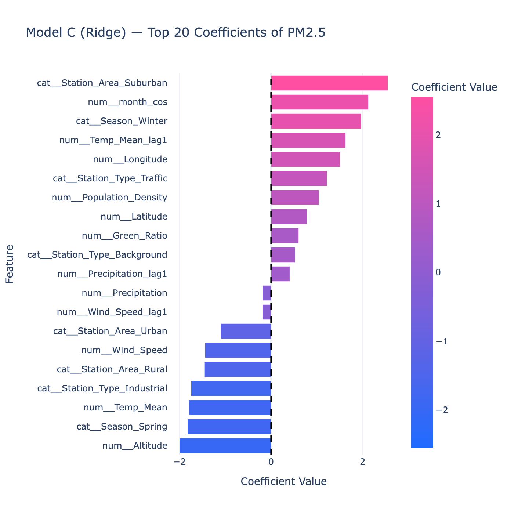

---

### [Comparison: Model A vs Model C](model.ipynb#model-a-vs-model-c--performance-comparison)
The non-linear model (A) clearly outperforms the linear baseline (C) across both evaluation settings, with the gap especially pronounced in the **time split**.

| | Model A (Random Forest) | Model C (Ridge) |
|---|---|---|
| **R² (Time)** | **0.29** | 0.10 |
| **R² (Spatial)** | **0.47** | 0.28 |
| **Error (RMSE)** | Lower (10.47 / 6.00) | Higher (11.77 / 7.02) |
| **Residuals** | Centered and symmetric | Wider spread, positively skewed |
| **Top drivers** | Month, Latitude, Longitude, Altitude | Station type, Month, Altitude, Wind |

**Metric comparison**

The metric comparison confirms that Model A consistently achieves **lower RMSE and MAE** across both time and spatial splits, indicating more accurate predictions overall.

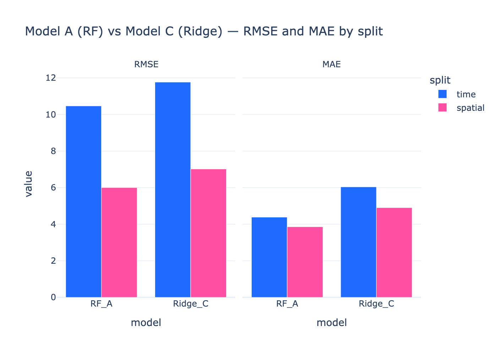

**Residuals — Time split**

In the time-based evaluation, Model A’s residuals are **tightly concentrated around zero**, showing stable predictions over time.  
In contrast, Model C exhibits a **wider distribution with a noticeable positive tail**, indicating that it tends to **underestimate high PM2.5 values**.

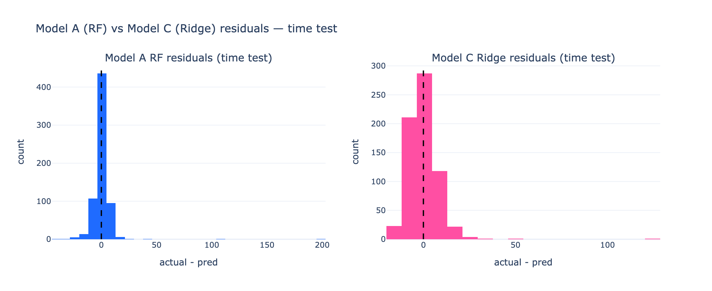

**Residuals — Spatial split**

In the spatial split, the difference becomes even clearer. Model A maintains a **compact and symmetric error distribution**, while Model C shows **higher variance and more extreme residuals**, confirming weaker generalization across locations.

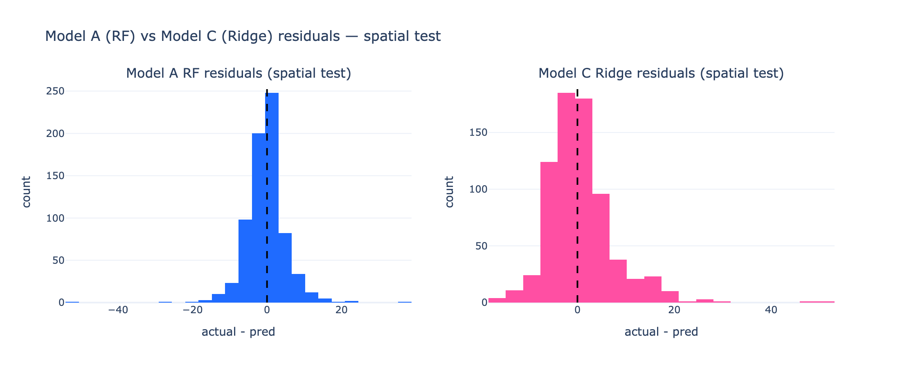

**Shared feature comparison**

The comparison of the top shared features reveals clear differences in how the two models rely on the same variables.
Overall, Model A concentrates importance in a few key drivers, whereas Model C spreads importance across many features, confirming that linear models struggle to isolate the dominant non-linear factors driving PM2.5.
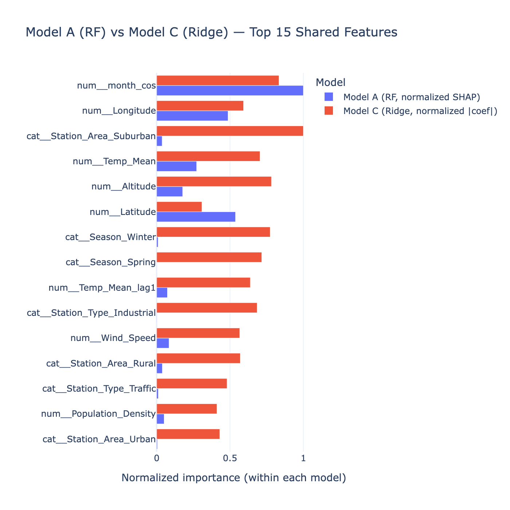
--- 

### Key takeaway

Overall, these results confirm that PM2.5 dynamics are driven by **non-linear relationships** between environmental and spatial factors. Model C underfits the data, while Model A is able to capture these complex interactions more effectively.

### Overall Model Performance

| Model | Split | RMSE | MAE | R² |
|---|---|---|---|---|
| **Model A** (RF – No Lags) | Time | 10.47 | 4.38 | 0.289 |
| **Model B** (RF – With Lags) | Time | 10.46 | 4.31 | 0.290 |
| **Model C** (Ridge) | Time | 11.77 | 6.04 | 0.101 |
| **Model A** (RF – No Lags) | Spatial | 6.00 | 3.86 | 0.474 |
| **Model B** (RF – With Lags) | Spatial | **4.75** | **2.90** | **0.671** |
| **Model C** (Ridge) | Spatial | 7.02 | 4.90 | 0.282 |

---

## 6. Conclusion & Business Insights

### Final Model Recommendation

**Model B is the most robust predictor**, achieving a massive leap in the spatial split (R² = 0.671 vs. 0.474 for Model A). This confirms that PM2.5 is a process of **temporal persistence** — today's air quality is heavily anchored to the accumulation of previous months.

**We recommend a dual-model deployment strategy:**

1. **Model B — Operational Forecasting:** Superior generalization to unseen stations makes it the most reliable tool for real-time monitoring. Predict next month's PM2.5 levels at any Italian station with high accuracy.

2. **Model A — Urban Planning & Policy Simulation:** Because it does not rely on previous pollution levels (which a city cannot change), Model A isolates and simulates how changing actionable variables — green ratio, land use, urban density — would directly impact air quality. This is the right tool for "what-if" scenario planning.

---

### Key Business Insights

**1. The Po Valley Problem is Geographic, Not Just Industrial**
The North–South pollution gradient is strongly mediated by topography. The Po Valley basin, enclosed by Alpine and Apennine mountain ranges, restricts atmospheric circulation and allows pollutants to accumulate. PM2.5 levels at low-altitude stations are systematically higher regardless of emissions. Policy interventions that ignore terrain will underestimate exposure risk in low-lying areas.

**2. Human Activity is a Direct Pollution Switch**
The COVID-19 lockdown produced a measurable, sharp drop in PM2.5 and NO₂ in 2020. This is direct evidence that traffic and industrial activity are the main emission drivers — and that pollution responds rapidly to behavioral change. Urban mobility policies (e.g. low-emission zones, electric vehicle incentives) can deliver measurable air quality improvements within months.

**3. Green Space is a Quantifiable Pollution Reducer**
The negative correlation between green ratio and PM2.5 (confirmed both in EDA and by SHAP analysis) means urban greening is not merely aesthetic. Adding 10 percentage points of green cover to a city's land use could contribute to a measurable reduction in PM2.5. This supports investment in parks, urban forests, and agricultural buffers around dense residential areas.

**4. Population Density Amplifies Exposure**
Denser cities experience higher PM2.5, and that pollution affects more people per square kilometer. Identifying the highest-density, highest-pollution municipalities in the Po Valley allows public health authorities to prioritize air quality interventions and healthcare resource planning where the disease burden is greatest.

**5. Seasonal Dynamics Are Non-Negotiable for Planning**
Annual averages mask the critical winter peaks driven by temperature inversions and heating. Monthly forecasting (Model B) gives municipalities advance warning of high-risk months, enabling preemptive measures such as traffic restrictions or industrial emission caps before winter smog events occur.

**6. The Framework Is Exportable**
While this analysis focuses on Italy, the same pipeline — EEA data + CORINE land cover + OpenAQ monthly + Open-Meteo weather — is replicable for any European country. Similar geographic risk zones exist in southern Poland (Silesian basin), northern France (industrial corridor), and the Ruhr Valley in Germany. A scalable version of Model B could be deployed Europe-wide to support the EU's Zero Pollution Action Plan.

---

### Stakeholders

This analysis is directly relevant to:
- **Public health authorities** — identifying high-risk populations and informing healthcare demand forecasting
- **Environmental protection agencies** — evidence-based regulatory targeting of high-pollution zones
- **Urban planners** — quantified ROI on green infrastructure, land use zoning, and traffic policy
- **Municipal governments** — monthly early-warning tools for smog season preparation

---

*Project developed for the Accenture Data Science Challenge. Data source: European Environment Agency (EEA) Annual Air Quality Statistics 2015–2024.*
